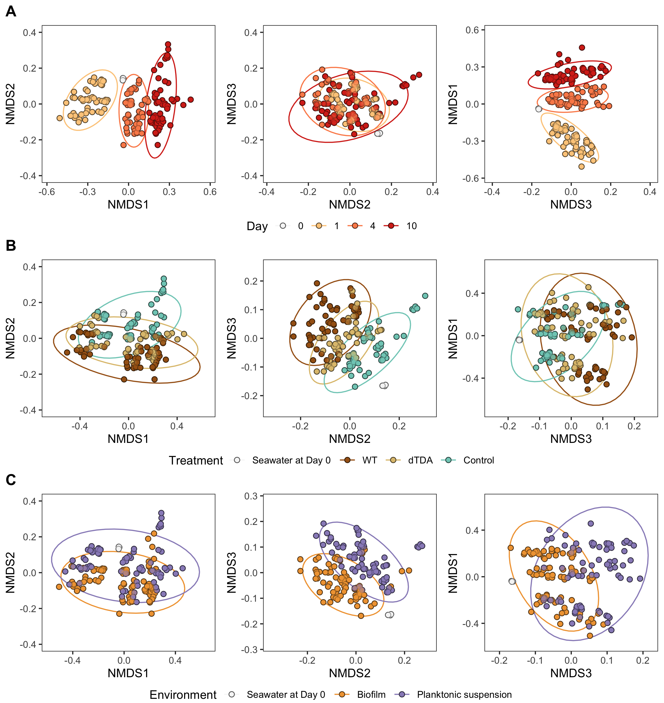
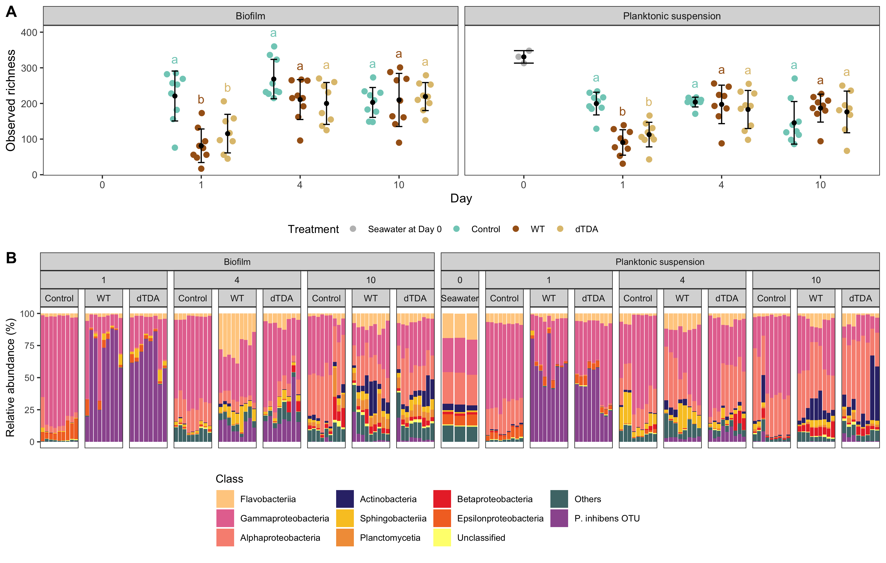

# Data and scripts to reproduce results from the manuscript with data in BioProject PRJNA795304

### Data
All data used in the study can be found in the folder: 'Data/'.

Two files for the creation of the phyloseq object in the R script "phylo_main_no_cont_NoOutliers.R" 
- ASV_table.txt created by the QIIME2 and DADA2 pipeline
- metadata.txt all metadata explaining each sample

Statistical analysis of the qPCR of the absolutte population and Phaeobacter spp. abundances
- 16S_absolutte_qPCR_2.txt
- qPCR_040521_50ulelute.txt

### Scripts
All scripts used for analysis can be found in 'Rscripts/'. 

All downstream analysis loads phyloseq created in: 
- phylo_main_no_cont_NoOutliers.R

Low abundant read cut-off were analysed and determined in "Filtration210921.R". 

The alpha-diversity analysis, including Table 1 and Figure S1 were created with "alpha_161121.R". 
The beta-analysis including beta-dispersion, PERMANOVA (Table 1), posthoc test for pair-wise differences within each variable (Table 2), scree and NMDS plots (Figure 2) were analysed in "Beta-diversity_131022.R"

The differential analysis using the ANCOM-BC model comparing all groups were created with "ANCOMBC_040422.R" and the final compison between the WT and dTDA samples from either the biofilm or the planktonic suspesion at day 4 were vizualised in Figure 3. 

Network analyses comparing the WT and the dTDA microbiome of each day from both environments, respectively were carried out in "NetCoMi_030122.R" including Figure 4A. Positive and negative correlations between the 'P. inhibens OTU' and other genera at day 4 in the biofilm were extracted from the NetComi constructed network WT and dTDA comparison and their respective LogFC changes (dertermined in "ANCOMBC_040422.R") were combined in Figure 4B. The netCompare function was used to calculate significant changes between the network scores (betweenness, degree, closeness, and eigenvector centrality) between the WT and the dTDA networks constructed on samples from either the biofilm or the planktonic suspension at each day, respectively and to determine keystones. All network scores and p-values were summerized in Table S1. 

Absolutte population and Phaeobacter spp. abundances were analysed in "qPCR_040422.R" (Table 1; Figure 1)

# Figure 1

# Figure 2

# Figure 3

# Figure 4

# Figure S1

